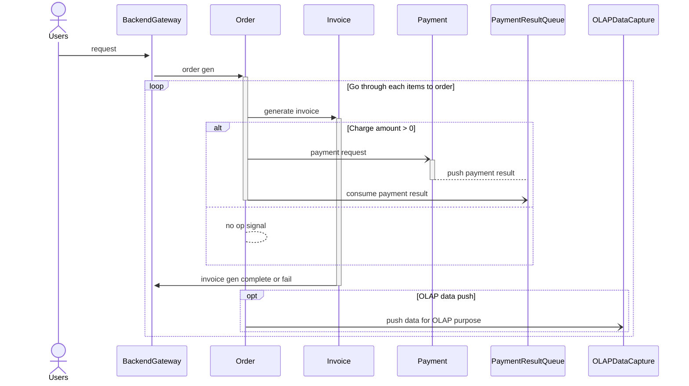

# Mermaid

Here's a sample of Sequence Diagram embedded in MD

```mermaid
sequenceDiagram
    actor U as Users
    participant BGW as BackendGateway
    participant ORD as Order
    participant INV as Invoice
    participant PAY as Payment
    participant PRQ as PaymentResultQueue
    participant OLAP as OLAPDataCapture
    U ->>+ BGW: request
    BGW ->>+ ORD: order gen
    loop Go through each items to order
        ORD ->>+ INV: generate invoice
        alt Charge amount > 0
            ORD -)+ PAY: payment request
            PAY --> PRQ: push payment result
            deactivate PAY
            ORD -)- PRQ: consume payment result
        else
            ORD --> ORD: no op signal
        end
        INV ->>- BGW: invoice gen complete or fail
        opt OLAP data push
            ORD -) OLAP: push data for OLAP purpose
        end

    end

```
